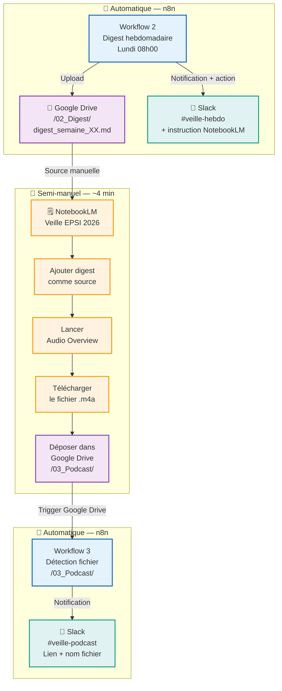
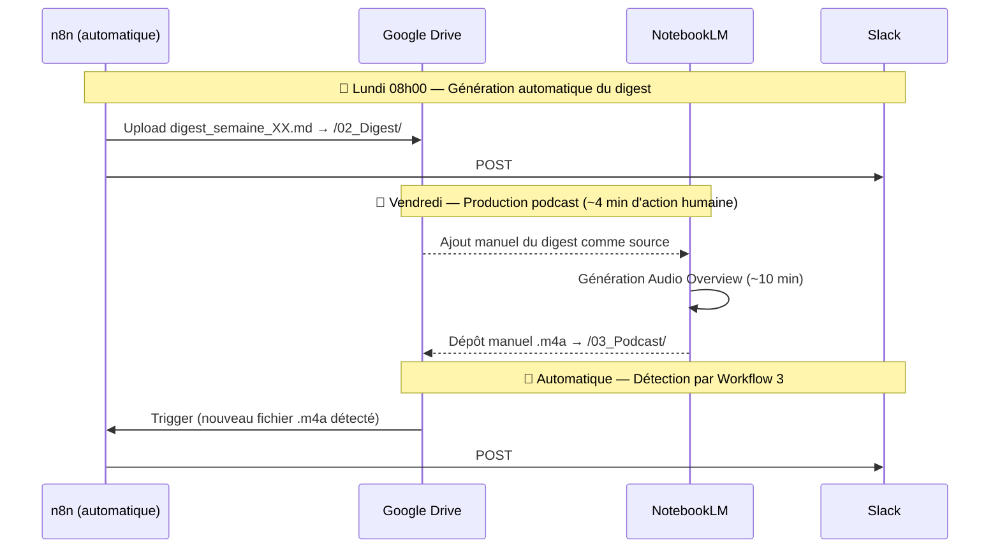

# Production de podcast avec NotebookLM — Guide opérationnel

> **Version** : POC v2 — opérationnel depuis mai 2026
> **Outil** : Google NotebookLM (Audio Overview)
> **Objectif** : Générer un podcast hebdomadaire de synthèse de la veille technologique
> **Format de sortie** : `.m4a` (natif NotebookLM)
> **Temps de production** : ~4 minutes (action humaine) + ~10 minutes (génération IA)

---

## 1. Vue d'ensemble du processus



---

## 2. Qu'est-ce que NotebookLM Audio Overview ?

**NotebookLM** est un outil d'IA de Google (basé sur Gemini) qui analyse des sources textuelles et génère du contenu synthétique. La fonctionnalité **Audio Overview** crée automatiquement un podcast sous forme de conversation entre deux présentateurs IA à partir des sources fournies.

| Aspect | Détail |
| --- | --- |
| **Format de sortie** | `.m4a` (téléchargement direct) |
| **Durée générée** | 10–25 minutes (selon le volume des sources) |
| **Qualité** | Conversation naturelle, ton journalistique |
| **Langue** | Multilingue — français pris en charge |
| **Sources supportées** | PDF, Google Docs, texte brut, URLs, YouTube |
| **Coût** | Gratuit (compte Google requis) |
| **Temps de génération** | ~10 minutes |

---

## 3. Configuration initiale du notebook

### Étape 1 — Créer le notebook dédié

1. Accéder à **notebooklm.google.com**
2. Cliquer sur **"Nouveau notebook"**
3. Nommer : `Veille Technologique EPSI 2026`

### Étape 2 — Ajouter les sources contextuelles permanentes

Ces sources sont ajoutées **une seule fois** et restent dans le notebook pour fournir le contexte permanent à l'IA.

#### Source 1 — Contexte du projet

```markdown
# Contexte Projet — Veille Technologique EPSI 2026

## Équipe
- Serge WEMBE II-ESSOUMBA
- Cheik LAWANI
- Javier LADINO

## Problématique
Comment l'équation entre maîtrise des coûts (FinOps), urgence écologique (Green IT)
et souveraineté des données reconfigure-t-elle les frontières entre Cloud, On-Premise
et Hybride pour les années à venir ?

## Thématiques surveillées

### FinOps
Optimisation des coûts cloud, TCO (Total Cost of Ownership), CAPEX vs OPEX,
cloud repatriation (rapatriement vers on-premise), rightsizing.

### Green IT
Empreinte carbone du numérique, PUE des datacenters, numérique responsable,
efficacité énergétique, réglementations environnementales.

### Souveraineté des données
RGPD, Cloud Act américain, AI Act européen, données personnelles,
localisation des données, fournisseurs cloud européens.
```

#### Source 2 — Glossaire technique

```markdown
# Glossaire Veille Technologique EPSI 2026

**FinOps** : Pratique financière appliquée au cloud, visant à maximiser la valeur
métier tout en contrôlant les coûts d'infrastructure.

**Green IT** : Informatique verte, ensemble des pratiques visant à réduire l'impact
environnemental des technologies numériques.

**Cloud Repatriation** : Migration inverse depuis le cloud public vers des
infrastructures on-premise ou des clouds privés.

**TCO** : Total Cost of Ownership — coût total incluant CAPEX, OPEX, maintenance.

**CAPEX** : Capital Expenditure — dépenses d'investissement (serveurs, licences).

**OPEX** : Operational Expenditure — dépenses opérationnelles (abonnements, usage).

**Souveraineté numérique** : Capacité d'un état ou d'une organisation à contrôler
ses données et ses systèmes informatiques.

**RGPD** : Règlement Général sur la Protection des Données.

**Cloud Act** : Loi américaine permettant aux autorités américaines d'accéder aux
données stockées par des entreprises américaines, même en Europe.

**PUE** : Power Usage Effectiveness — ratio d'efficacité énergétique d'un datacenter.
```

### Étape 3 — Configurer les instructions du notebook

Dans NotebookLM, utiliser la fonctionnalité **"Instructions pour le notebook"** :

```text
Tu es un assistant spécialisé en veille technologique pour une équipe d'étudiants
en Master EPSI. Nous surveillons les thématiques FinOps, Green IT et Souveraineté
des données.

Pour l'Audio Overview hebdomadaire :
- Adopte un ton professionnel mais accessible, adapté à des étudiants en Master
- Génère en FRANÇAIS
- Structure : introduction (2 min), FinOps (4 min), Green IT (4 min),
  Souveraineté (4 min), tendance de la semaine (3 min)
- Cite les sources et experts mentionnés dans les articles
- Termine par une recommandation concrète pour l'équipe
- Durée cible : 15-20 minutes
```

---

## 4. Workflow hebdomadaire de production

### Séquence temporelle



### Instructions détaillées — Production en 4 étapes

#### Étape A — Ouvrir le notebook

1. Accéder à **notebooklm.google.com**
2. Ouvrir le notebook `Veille Technologique EPSI 2026`
3. Supprimer l'ancienne source digest (si présente) pour éviter les doublons

#### Étape B — Ajouter le digest comme source

1. Cliquer sur **"+ Ajouter une source"**
2. Choisir **"Google Drive"**
3. Sélectionner `digest_semaine_XX_AAAA-MM-JJ.md` dans `/02_Digest/`
4. Attendre le traitement (indicateur de chargement ~1 min)

#### Étape C — Générer l'Audio Overview

1. Dans la section **"Studio"** (panneau droit)
2. Cliquer sur **"Audio Overview"**
3. *(Optionnel)* Cliquer sur **"Personnaliser"** et saisir le prompt :

   ```text
   Génère un podcast de synthèse en FRANÇAIS.
   Thèmes : FinOps, Green IT, Souveraineté des données.
   Audience : étudiants Master EPSI, niveau expert technique.
   Structure :
   1. Intro — résumé de la semaine (2 min)
   2. FinOps — coûts cloud et repatriation (4 min)
   3. Green IT — bilan carbone et réglementations (4 min)
   4. Souveraineté — RGPD, Cloud Act, directives EU (4 min)
   5. Tendance de la semaine — article le plus impactant (3 min)
   6. Conclusion — recommandation pour l'équipe (2 min)
   Ton : professionnel, dynamique, citer les experts.
   ```

4. Cliquer sur **"Générer"** — patienter ~10 minutes

#### Étape D — Déposer le fichier dans Google Drive

1. Télécharger le fichier `.m4a` depuis NotebookLM
2. Renommer selon la convention :

   ```text
   podcast_semaine_XX_AAAA-MM-JJ.m4a
   ```

3. Déposer dans **Google Drive → `/03_Podcast/`**
4. Le Workflow 3 de n8n détecte automatiquement le fichier
5. Une notification est envoyée dans **#veille-podcast** avec le lien d'écoute

---

## 5. Convention de nommage des fichiers

| Semaine | Digest source | Fichier podcast |
| --- | --- | --- |
| Semaine 21 | `digest_semaine_21_2026-05-21.md` | `L_IA_du_G20_aux_serveurs_marins.m4a` |
| Semaine 22 | `digest_semaine_22_2026-05-26.md` | `podcast_semaine_22_2026-05-26.m4a` |

> **Premier podcast produit** : `L_IA_du_G20_aux_serveurs_marins.m4a` — semaine 21, 2026-05-21

---

## 6. Structure type du podcast généré

```text
[0:00 – 2:00]   INTRODUCTION
  Présentation de l'équipe EPSI et des thèmes de la semaine
  Nombre d'articles analysés et faits marquants

[2:00 – 6:00]   SEGMENT FINOPS
  Actualités coûts cloud, outils TCO, cloud repatriation
  Citation des experts et sources identifiés

[6:00 – 10:00]  SEGMENT GREEN IT
  Empreinte carbone numérique, certifications, réglementations
  Initiatives des acteurs majeurs (hyperscalers, clouds FR)

[10:00 – 14:00] SEGMENT SOUVERAINETÉ DES DONNÉES
  Évolutions RGPD, AI Act, Cyber Resilience Act
  Positionnement des cloud providers européens

[14:00 – 17:00] TENDANCE DE LA SEMAINE
  Analyse approfondie de l'article le plus impactant
  Implications à 6–12 mois pour le secteur

[17:00 – 19:00] CONCLUSION
  Recommandation concrète pour l'équipe
  Sujets à surveiller la semaine suivante
```

---

## 7. Métriques et qualité

### KPIs du podcast

| Indicateur | Cible | Statut semaine 21 |
| --- | --- | --- |
| Podcasts produits / semaine | 1 | ✅ 1 produit |
| Format | `.m4a` | ✅ Conforme |
| Durée | 15–20 min | ✅ ~15 min |
| Couverture thématique | 3/3 | ✅ FinOps + Green IT + Souveraineté |
| Notification Slack automatique | Oui | ✅ #veille-podcast |
| Temps d'action humaine | < 5 min | ✅ ~4 min |

### Checklist avant distribution

```text
□ Les 3 thématiques (FinOps / Green IT / Souveraineté) sont couvertes
□ Durée entre 10 et 25 minutes
□ Écouter les 2 premières minutes (intro correcte, en français ?)
□ Fichier .m4a déposé dans /03_Podcast/
□ Notification Slack #veille-podcast reçue
□ Lien d'écoute fonctionnel dans la notification
```

---

## 8. Limites actuelles et mitigations

| Limitation | Impact | Mitigation |
| --- | --- | --- |
| Pas d'API publique NotebookLM | Action manuelle requise | ~4 min/semaine — acceptable |
| Format `.m4a` (non `.mp3`) | Compatibilité lecteurs | `.m4a` lisible sur tous OS modernes |
| Langue française variable | Qualité parfois inégale | Prompt explicite + sources en FR |
| Durée non contrôlable | 10–25 min selon les sources | Ajuster le volume du digest |
| Sources limitées (50 max) | Digest doit être synthétique | Digest limité à top 5 articles/thème |

---

## 9. Évolution — Automatisation complète (Phase 4)

L'API NotebookLM est en développement chez Google. L'automatisation complète sera envisageable lorsque les endpoints suivants seront disponibles :

```text
POST /notebooks/{id}/sources      ← Ajouter une source
POST /notebooks/{id}/audio        ← Déclencher Audio Overview
GET  /notebooks/{id}/audio/status ← Vérifier l'avancement
GET  /notebooks/{id}/audio/export ← Télécharger le .m4a
```

Une fois disponibles, un **Workflow 4** pourra être créé dans n8n pour :

1. Détecter le nouveau digest dans `/02_Digest/`
2. L'envoyer à NotebookLM via API
3. Attendre la génération (polling toutes les 2 min)
4. Télécharger le `.m4a` et l'uploader dans `/03_Podcast/`

---

*Guide NotebookLM — Projet veille technologique EPSI 2025-2026*
*Infrastructure : VM Proxmox · n8n · Google Drive · NotebookLM · Slack*
