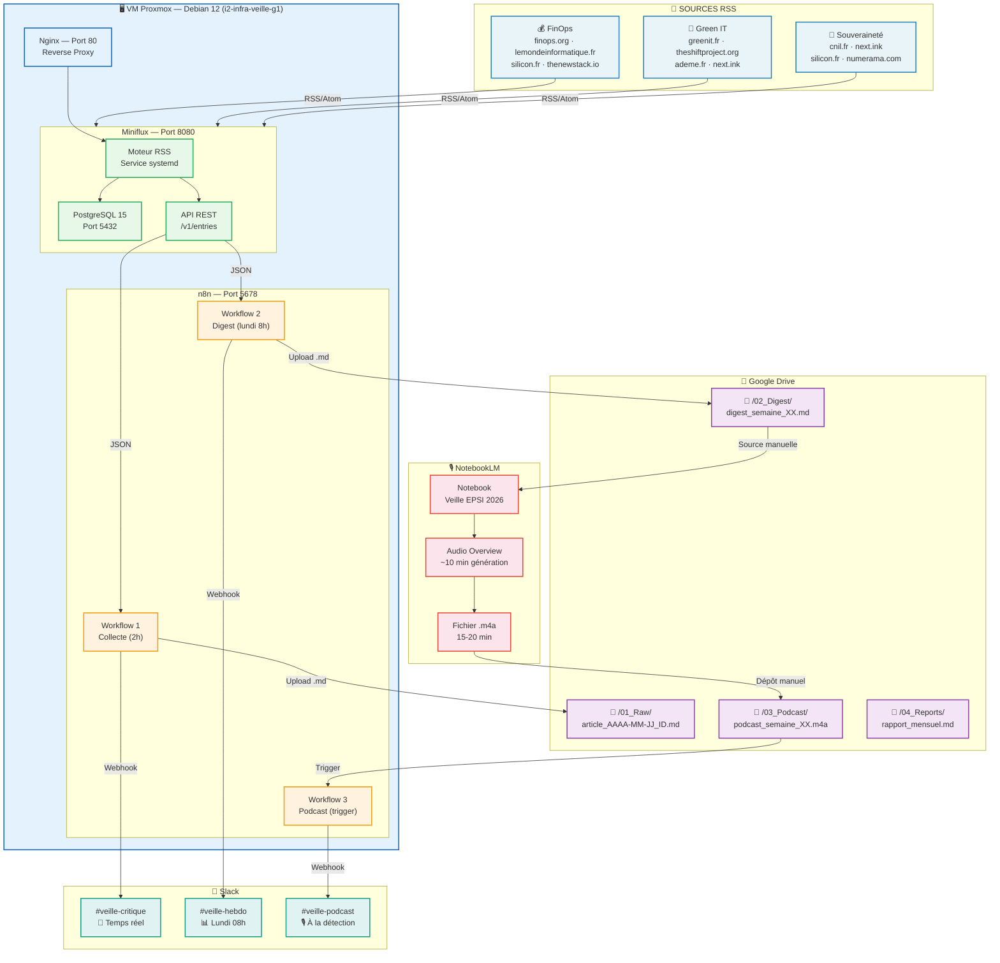
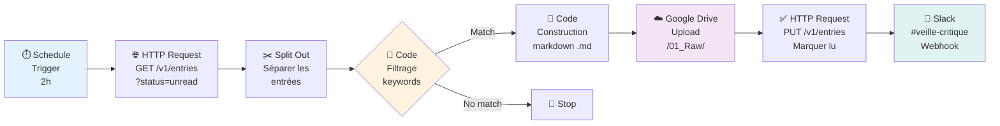
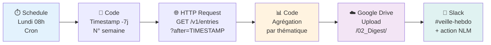
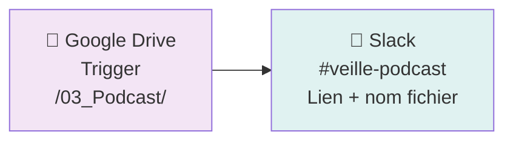
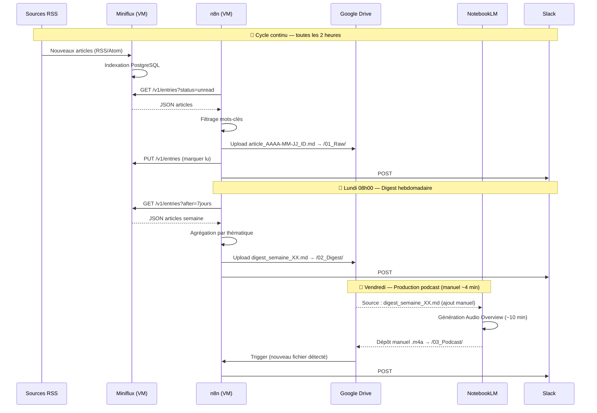

# Architecture & Pipeline de données — POC v2

> **Projet** : Système de Veille Technologique EPSI 2026
> **Stack** : Miniflux · n8n · Google Drive · Slack · NotebookLM
> **Infrastructure** : VM Proxmox (Debian 12) — Self-hosted natif, sans Docker

---

## 1. Architecture globale



---

## 2. Workflow 1 — Collecte des articles

**Déclenchement** : toutes les 2 heures, 24h/24



**Mots-clés de filtrage :**

```javascript
// FinOps
const finopsKw = ['finops', 'cloud cost', 'tco', 'cost optimization',
  'capex', 'opex', 'cloud billing', 'coût du cloud', 'budget cloud'];

// Green IT
const greenKw = ['green it', 'énergie', 'datacenter', 'empreinte carbone',
  'sustainability', 'carbon', 'renewable energy', 'sobriété numérique',
  'consommation énergétique', 'transition écologique'];

// Souveraineté
const sovKw = ['sovereignty', 'souveraineté', 'gdpr', 'rgpd',
  'cloud repatriation', 'ai act', 'données personnelles',
  'conformité', 'compliance', 'vie privée', 'réglementation'];
```

---

## 3. Workflow 2 — Digest hebdomadaire

**Déclenchement** : chaque lundi à 08h00



**Structure du digest généré :**

```text
# Digest Veille Technologique — Semaine XX
**Total articles** : N

## 💰 FinOps (N articles)
### Titre article
**Source** : X | **Date** : AAAA-MM-JJ
**URL** : https://...
Extrait...

## 🌿 Green IT (N articles)
## 🔐 Souveraineté des données (N articles)
## 📌 Autres (N articles)
```

---

## 4. Workflow 3 — Notification podcast

**Déclenchement** : création d'un fichier dans `/03_Podcast/`



---

## 5. Séquence temporelle hebdomadaire



---

## 6. Infrastructure physique

```text
┌─────────────────────────────────────────────────────────────────────┐
│                    PROXMOX — Hyperviseur on-premise                  │
│                                                                       │
│  ┌──────────────────────────────────────────────────────────────┐   │
│  │  VM : i2-infra-veille-g1                                      │   │
│  │  OS : Debian 12.4 (Bookworm)                                  │   │
│  │  IP : 172.16.89.44/16  |  Gateway : 172.16.255.254            │   │
│  │  Ressources : 2 vCPU · 2 Go RAM · 20 Go disque               │   │
│  │                                                               │   │
│  │  Services actifs :                                            │   │
│  │  ┌───────────────────┐  ┌────────────────────────────────┐   │   │
│  │  │  PostgreSQL 15    │  │  Miniflux (binaire natif)      │   │   │
│  │  │  Port 5432        │◄─│  Service : miniflux.service    │   │   │
│  │  │  DB : miniflux    │  │  Config : /etc/miniflux.conf   │   │   │
│  │  │  User : miniflux  │  │  Port : 127.0.0.1:8080         │   │   │
│  │  └───────────────────┘  └────────────────────────────────┘   │   │
│  │                                        ▲                      │   │
│  │  ┌─────────────────────────────────────┘                     │   │
│  │  │  Nginx (reverse proxy)                                     │   │
│  │  │  Port 80 → 127.0.0.1:8080                                 │   │
│  │  │  Config : /etc/nginx/sites-available/miniflux              │   │
│  │  └───────────────────────────────────────────────────────    │   │
│  │                                                               │   │
│  │  ┌──────────────────────────────────────────────────────┐   │   │
│  │  │  n8n (npm global)                                     │   │   │
│  │  │  Service : n8n.service                                │   │   │
│  │  │  Port : 127.0.0.1:5678                                │   │   │
│  │  │  WEBHOOK_URL : http://localhost:5678/                 │   │   │
│  │  └──────────────────────────────────────────────────────┘   │   │
│  └──────────────────────────────────────────────────────────────┘   │
│                                                                       │
│  Accès poste client :                                                │
│  ssh -L 8080:127.0.0.1:8080 jladino@172.16.89.44  → Miniflux        │
│  ssh -L 5678:127.0.0.1:5678 jladino@172.16.89.44  → n8n             │
└─────────────────────────────────────────────────────────────────────┘
                              │
                              │ HTTPS sortant (port 443)
                              ▼
┌─────────────────────────────────────────────────────────────────────┐
│                      SERVICES CLOUD (SaaS)                           │
│                                                                       │
│  Google Drive               Slack                NotebookLM          │
│  /01_Raw/                   #veille-critique     Notebook            │
│  /02_Digest/                #veille-hebdo        Veille EPSI 2026    │
│  /03_Podcast/               #veille-podcast      Audio Overview      │
│  /04_Reports/                                                         │
└─────────────────────────────────────────────────────────────────────┘
```

---

## 7. Modèle de données

```text
Article (01_Raw)
├── date            : Date (AAAA-MM-JJ)
├── source          : String (nom du flux RSS)
├── titre           : String
├── url             : String (URL canonique)
├── tags            : Array[String]
└── résumé          : Text (extrait RSS, HTML strippé)

Digest (02_Digest)
├── semaine         : Integer (numéro ISO)
├── date            : Date
├── total_articles  : Integer
├── finops          : Array[Article] (max 5)
├── greenit         : Array[Article] (max 5)
├── sovereignty     : Array[Article] (max 5)
└── autres          : Array[Article] (max 5)

Podcast (03_Podcast)
├── semaine         : Integer
├── format          : String (.m4a)
├── durée           : Float (~15-20 min)
└── source_digest   : String (référence digest)
```

---

## 8. Matrice de décision infrastructurelle

| Dimension | VM Proxmox (v2) | VPS Cloud | Docker local |
|---|---|---|---|
| **Souveraineté** | ✅ Totale | ⚠️ Cloud tiers | ✅ Locale |
| **RGPD** | ✅ Conforme | ⚠️ CGU hébergeur | ✅ Conforme |
| **Coût** | ✅ 0€ | ~5€/mois | ✅ 0€ |
| **Disponibilité** | Proxmox uptime | 99.9% SLA | PC allumé |
| **Accès externe** | SSH tunnel | Direct HTTPS | Tunnel requis |
| **Maintenance** | APT updates | APT/Docker | Docker updates |
| **Scalabilité** | Selon Proxmox | Illimitée | Limité |

---

*Architecture rédigée pour le projet de veille technologique — Master EPSI 2025-2026*
*Infrastructure : VM Proxmox · Miniflux natif · n8n · Google Drive · Slack · NotebookLM*
