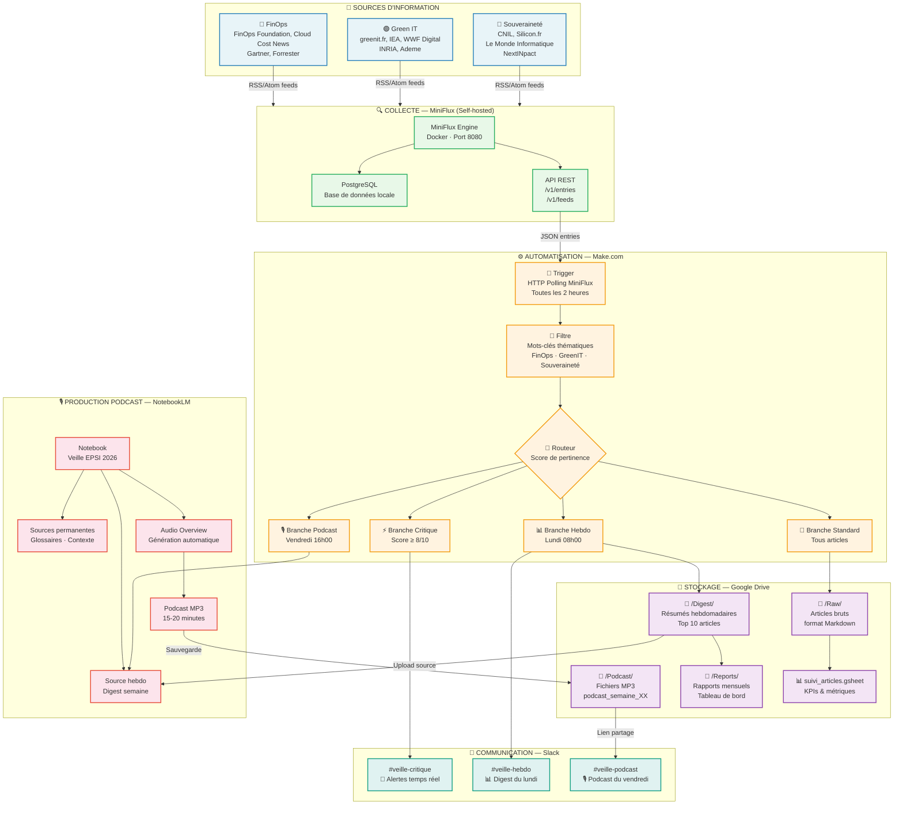
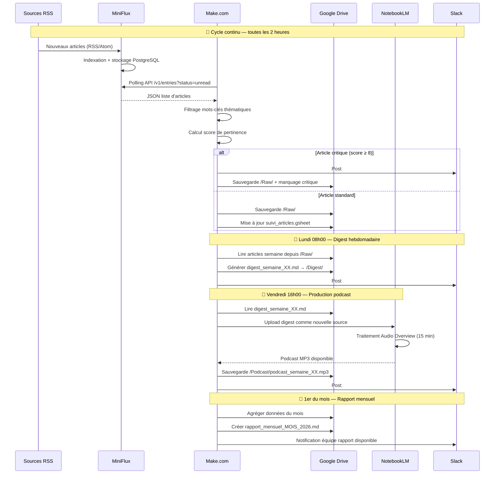

# Architecture & Pipeline de données — Version POC v2

> **Projet** : Système de Veille Technologique EPSI 2026  
> **Stack** : MiniFlux · Make.com · Google Drive · Slack · NotebookLM  
> **Document** : Schéma d'infrastructure et flux de données

---

## 1. Schéma d'infrastructure global (Mermaid)



---

## 2. Diagramme de séquence temporelle



---

## 3. Schéma d'infrastructure physique

```
┌─────────────────────────────────────────────────────────────────────┐
│                    ENVIRONNEMENT DE DÉPLOIEMENT                      │
│                                                                       │
│  Option A — Local (Dev)          Option B — VPS (Production)         │
│  ┌──────────────────────┐        ┌──────────────────────────────┐   │
│  │  MacBook / PC        │        │  VPS OVHcloud / Scaleway     │   │
│  │  Docker Desktop      │        │  2 vCPU · 4 Go RAM · 40 Go   │   │
│  │  ┌────────────────┐  │        │  Ubuntu 22.04 LTS            │   │
│  │  │  miniflux:8080 │  │        │  ┌──────────────────────┐    │   │
│  │  │  postgres:5432 │  │        │  │  miniflux:8080       │    │   │
│  │  └────────────────┘  │        │  │  postgres:5432       │    │   │
│  │  Accès : localhost   │        │  │  nginx:80/443 (HTTPS)│    │   │
│  └──────────────────────┘        │  └──────────────────────┘    │   │
│                                  │  Accès : https://veille.epsi  │   │
│                                  └──────────────────────────────┘   │
└─────────────────────────────────────────────────────────────────────┘
                              │
                              │ API REST HTTPS
                              ▼
┌─────────────────────────────────────────────────────────────────────┐
│                      SERVICES CLOUD (SaaS)                           │
│                                                                       │
│   Make.com              Google Drive            Slack                │
│   ┌──────────────┐      ┌──────────────┐       ┌──────────────┐    │
│   │ Scénario v2  │─────►│ /Raw/        │       │ #critique    │    │
│   │ 3 branches   │      │ /Digest/     │       │ #hebdo       │    │
│   │ Polling 2h   │      │ /Podcast/    │       │ #podcast     │    │
│   └──────────────┘      │ /Reports/    │       └──────────────┘    │
│          │              └──────────────┘                            │
│          │                     │                                     │
│          │              ┌──────▼──────┐                             │
│          └─────────────►│  NotebookLM │                             │
│                         │  Notebook   │                             │
│                         │  EPSI 2026  │                             │
│                         └─────────────┘                             │
└─────────────────────────────────────────────────────────────────────┘
```

---

## 4. Modèle de données — Article de veille

```
Article (entité principale)
├── id              : UUID (généré MiniFlux)
├── titre           : String
├── url             : String (URL canonique)
├── date_publication: DateTime
├── date_collecte   : DateTime (timestamp MiniFlux)
├── source_name     : String (nom du flux RSS)
├── source_url      : String (URL du flux)
├── contenu_html    : Text (article complet si disponible)
├── extrait         : Text (résumé RSS, max 500 chars)
├── tags_auto       : Array[String] (détectés par filtre Make.com)
├── thematique      : Enum[FinOps, GreenIT, Souveraineté, Hybride, Autre]
├── score_pertinence: Integer (1-10, calculé par Make.com)
├── statut          : Enum[nouveau, analysé, archivé]
└── path_drive      : String (chemin Google Drive)

Digest hebdomadaire
├── semaine         : Integer (numéro ISO semaine)
├── annee           : Integer
├── date_debut      : Date
├── date_fin        : Date
├── articles_count  : Integer
├── top_articles    : Array[Article.id] (max 10)
├── resume_finops   : Text
├── resume_greenit  : Text
├── resume_souv     : Text
├── tendance_semaine: Text
└── path_drive      : String

Podcast
├── semaine         : Integer
├── annee           : Integer
├── duree_minutes   : Float
├── digest_source   : Digest.id (référence)
├── notebooklm_nb   : String (ID notebook NotebookLM)
├── path_drive      : String (chemin MP3)
└── url_slack       : String (lien message Slack)
```

---

## 5. Matrice de décision infrastructurelle

| Dimension | MiniFlux Self-hosted | Feedly (v1) | Talkwalker (v1) |
|---|---|---|---|
| **Souveraineté** | ✅ Totale | ⚠️ Cloud US | ⚠️ Cloud US |
| **RGPD** | ✅ Conforme | ⚠️ CGU tiers | ⚠️ CGU tiers |
| **Coût** | ~5€/mois (VPS) | 7-18€/mois | 50€+/mois |
| **Maintenance** | Docker updates | Aucune | Aucune |
| **API** | ✅ REST complète | Limitée (tier) | Limitée (tier) |
| **Contrôle données** | ✅ Total | ❌ Aucun | ❌ Aucun |
| **Scalabilité** | Selon VPS | Illimitée | Illimitée |
| **Fonctionnalités** | RSS/Atom core | RSS + curation | Social + web |

---

*Architecture rédigée pour le projet de veille technologique — Master EPSI 2025-2026*
